# Shader

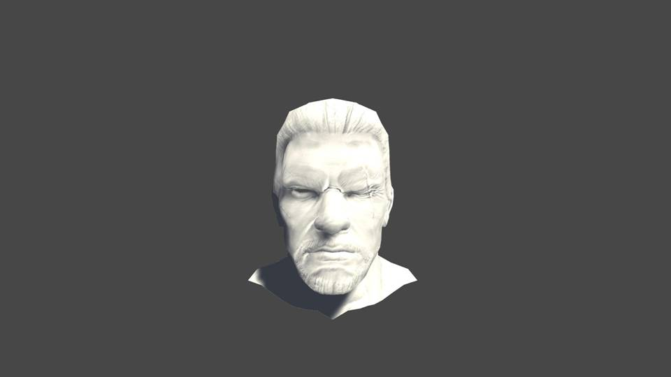

## BRDF : 비교
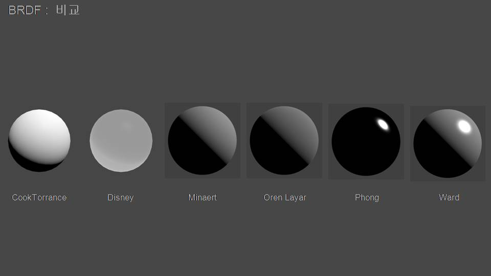

## Lighting Model : Basic Lighting Model
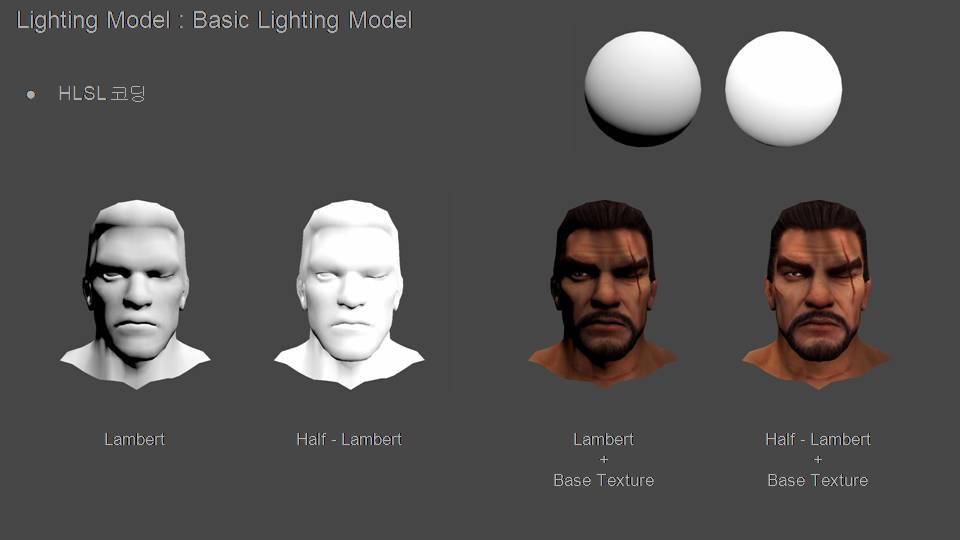

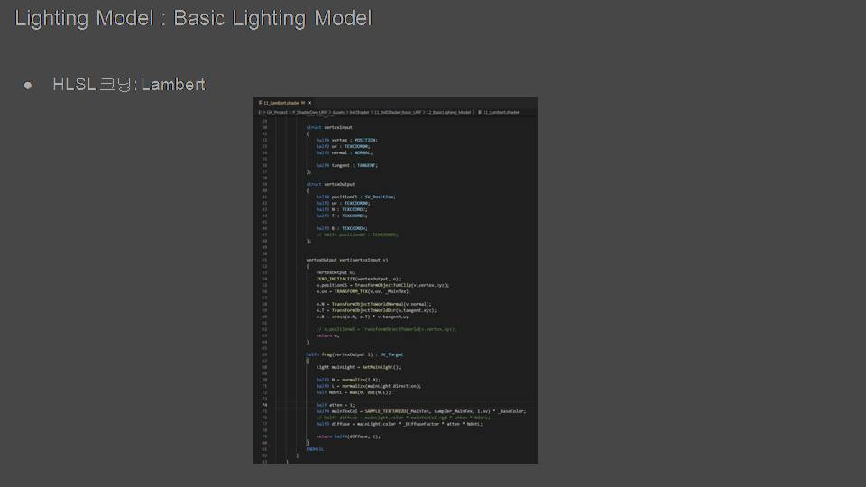
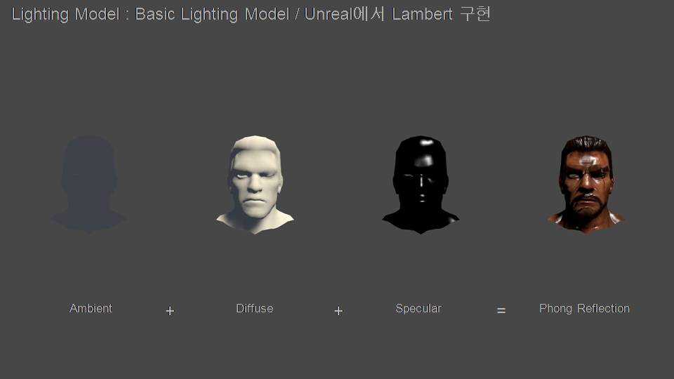
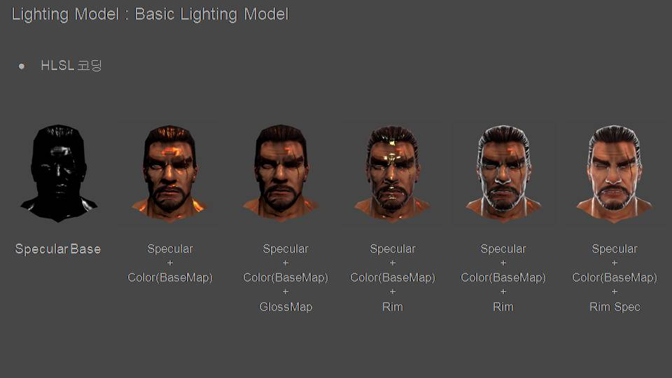
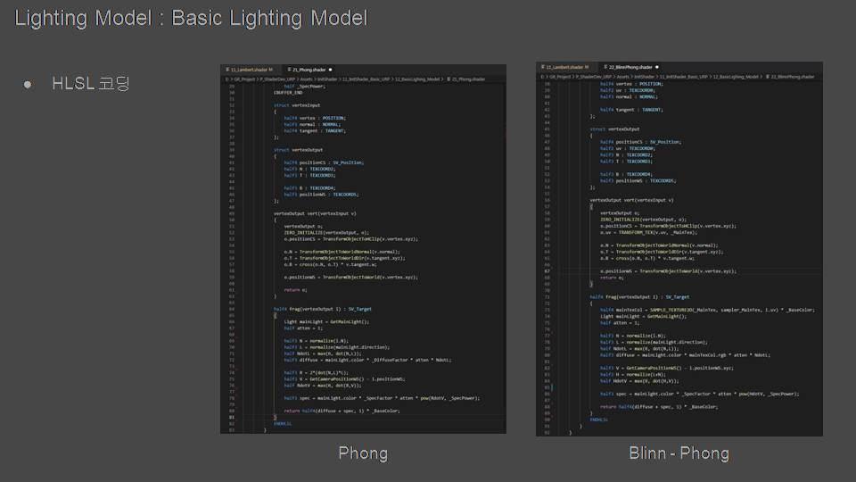

## Rim Lighting : Hologram
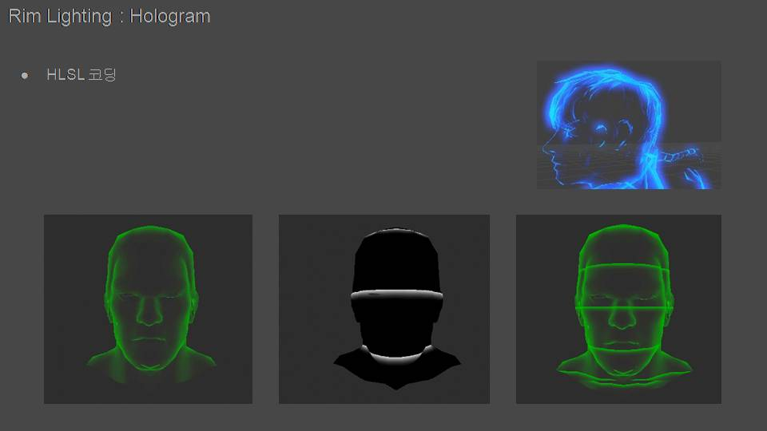
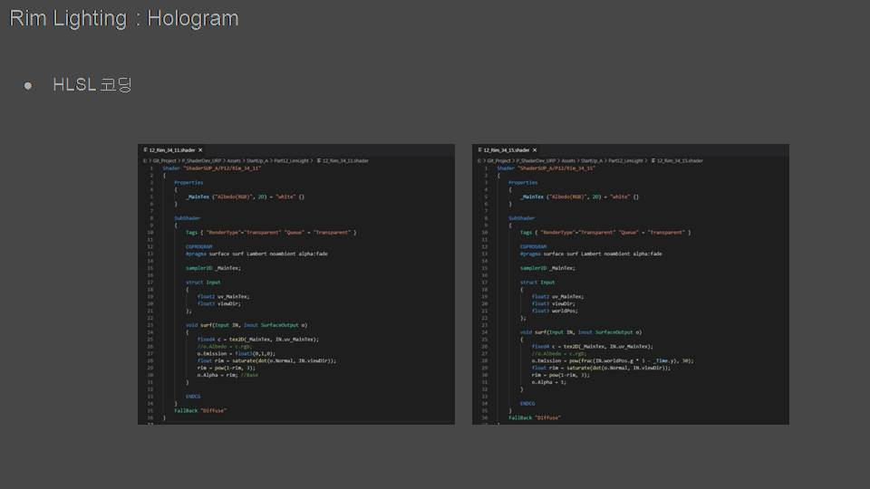

## FlowMap
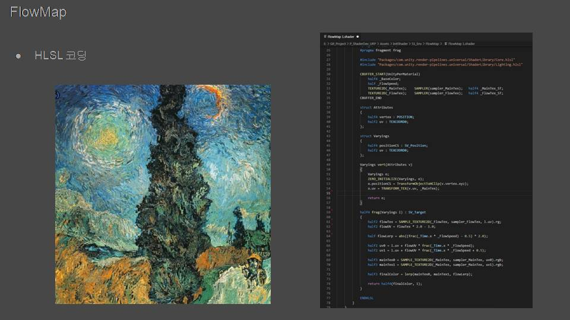

## Stencil
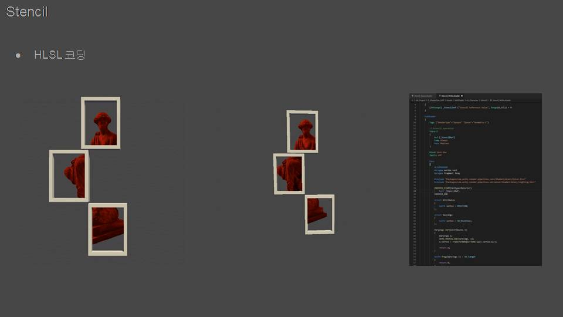

## Skin Material : Unreal Engine
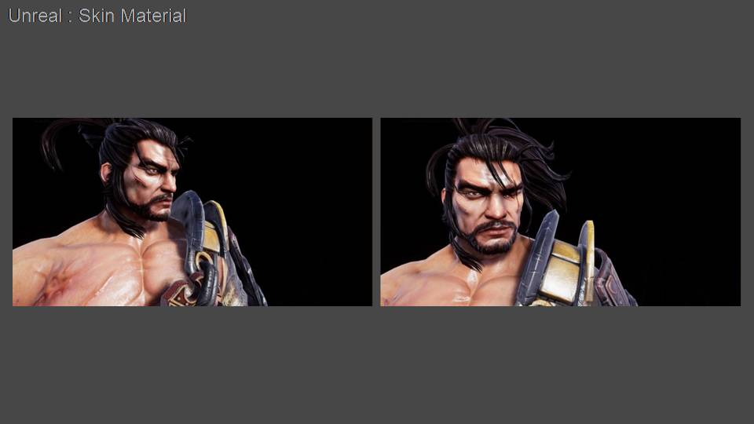

## Landscape : Unreal Engine
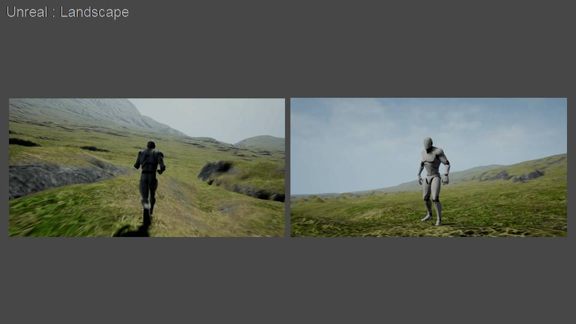
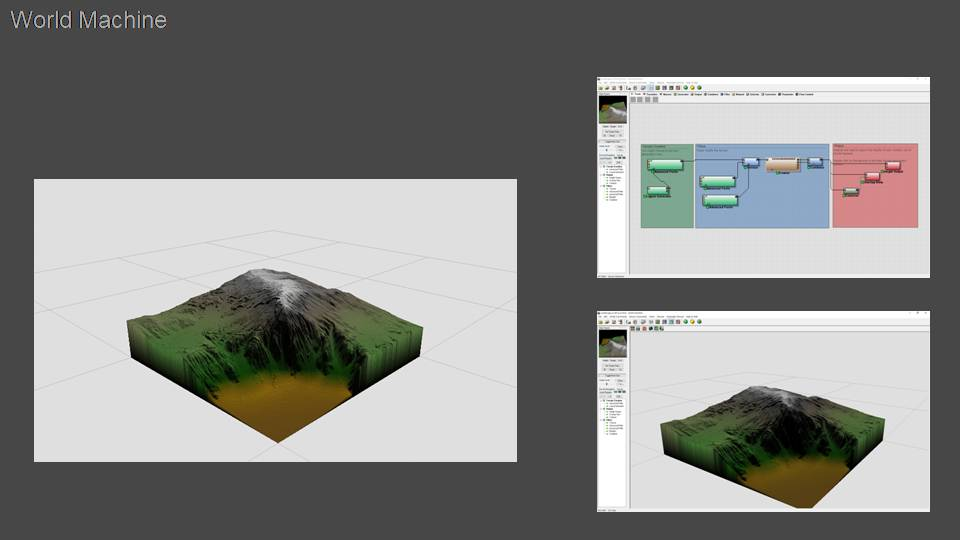

## NPR Shader 개선
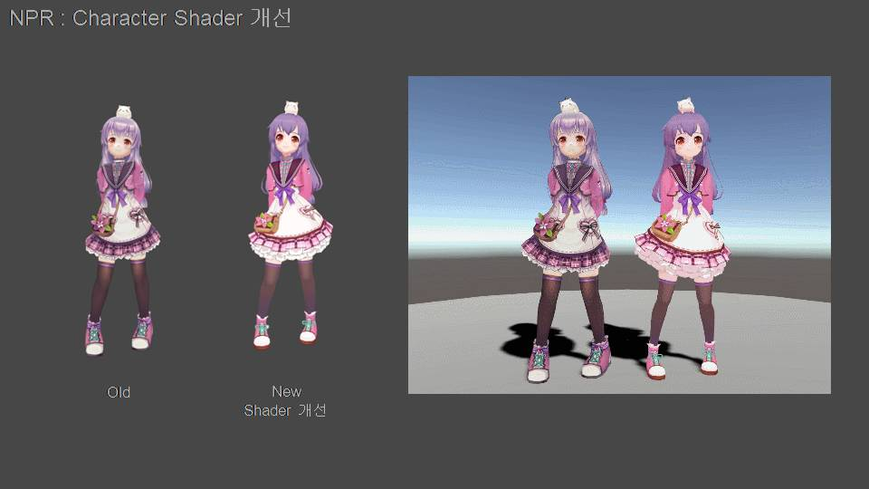

## Effect & Material
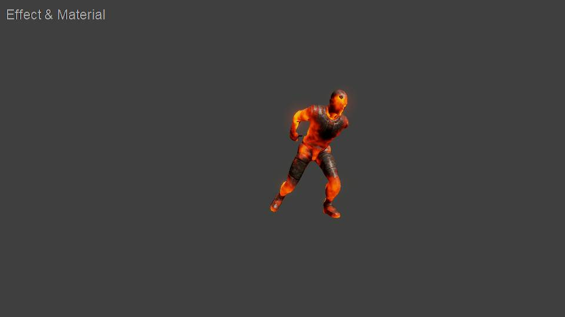
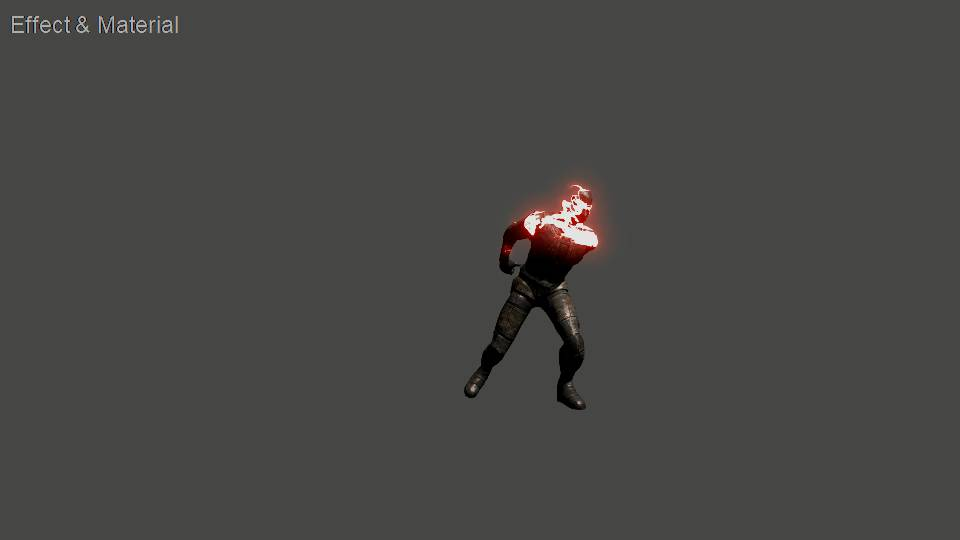

### BRDF

### Billboard

### Direction

### Dissolve

### FlatShader

### FlowMap

### ForceFieldShiled

### Glass

### HairAnisotropic

### Hatching

### Ice

### Lecture

###  LensFlare

### LighitngModel

### MatCap

### Noise

### NormalMap

## Basic

## Environment

## Optimize

## Post Process

## Res

# End
