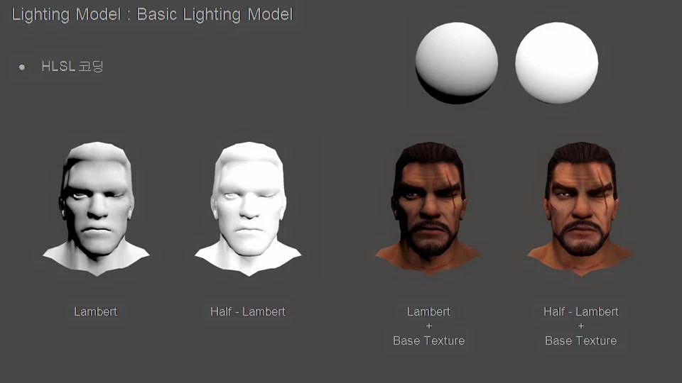
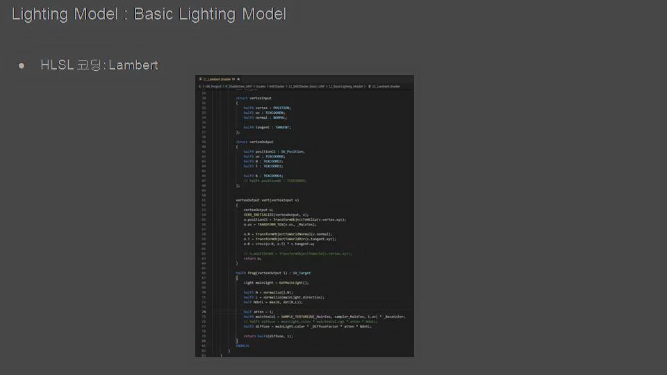
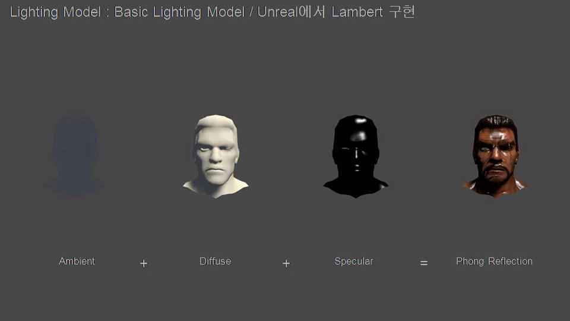
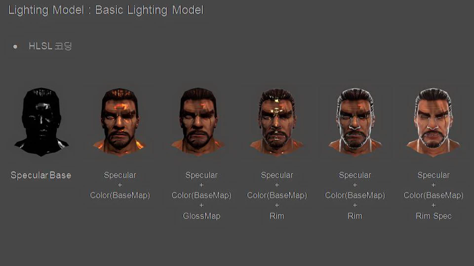
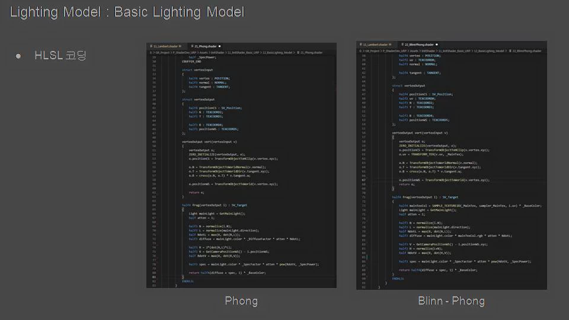
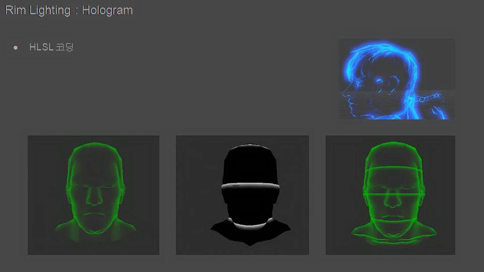
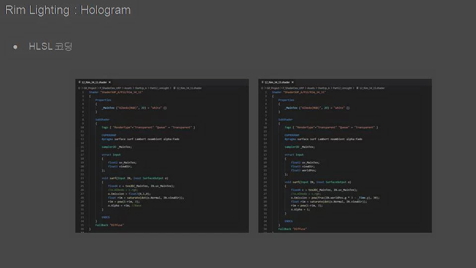
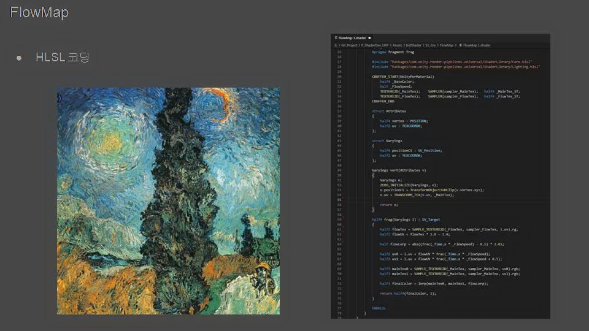
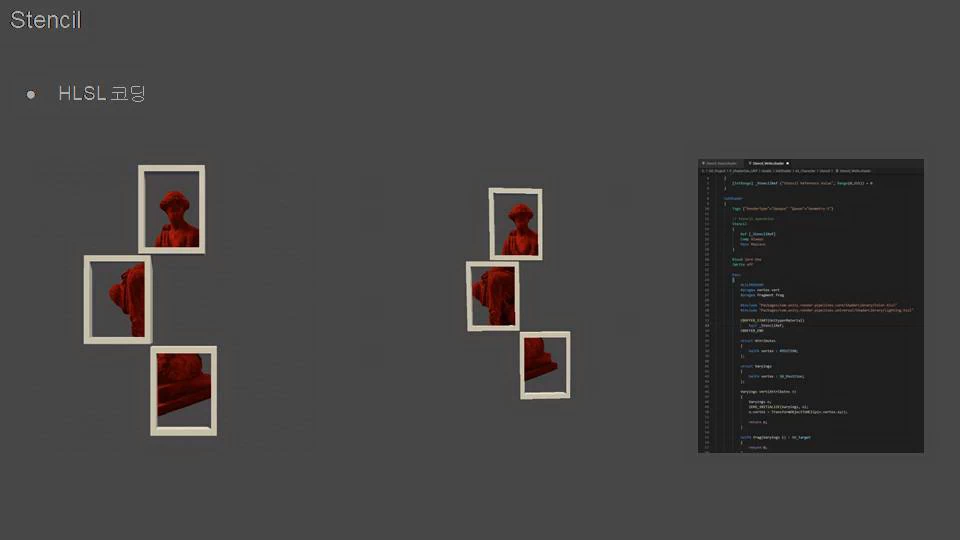

# Lighting

## Lighting Model : Basic Lighting Model

## Rim Lighting : Hologram

## FlowMap

## Stencil

## Skin Material : Unreal Engine

## Landscape : Unreal Engine

## World Mahcine : Landscape

## NPR Shader 개선

## Effect & Material

### BRDF

### Billboard

### Direction

### Dissolve

### FlatShader

### FlowMap

### ForceFieldShiled

### Glass

### HairAnisotropic

### Hatching

### Ice

### Lecture

###  LensFlare

### LighitngModel

### MatCap

### Noise

### NormalMap

## Basic

## Environment

## Optimize

## Post Process

## Res

# End

