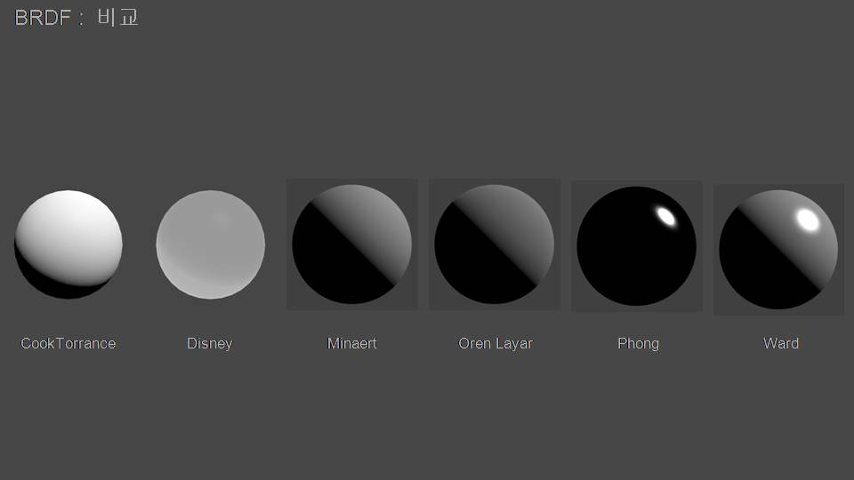
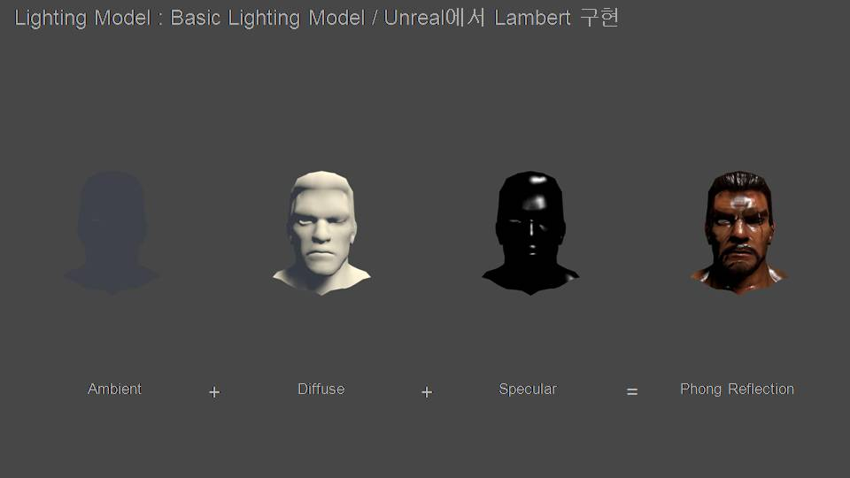
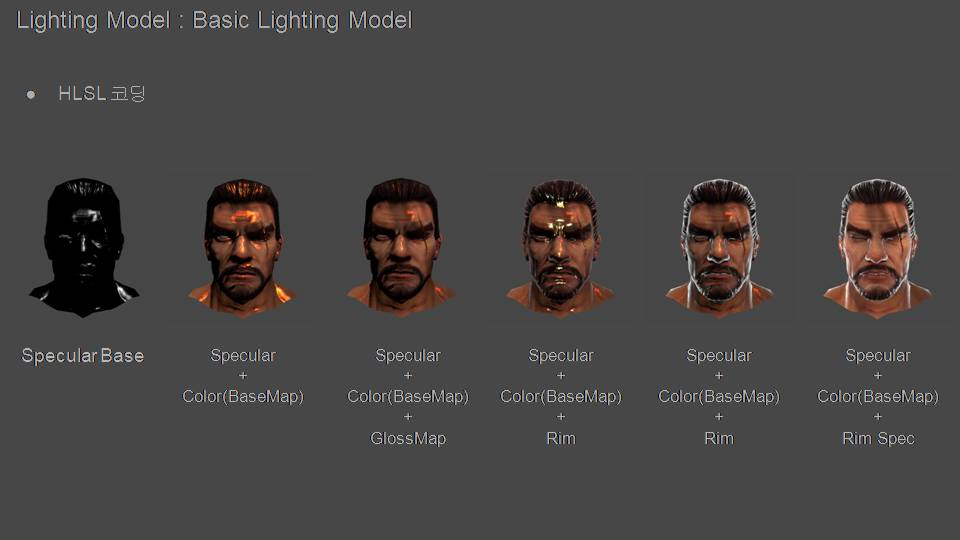
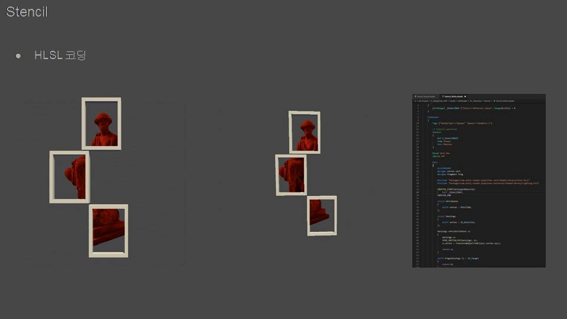
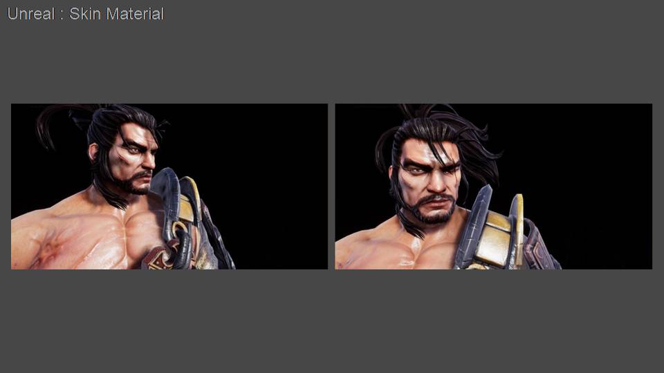
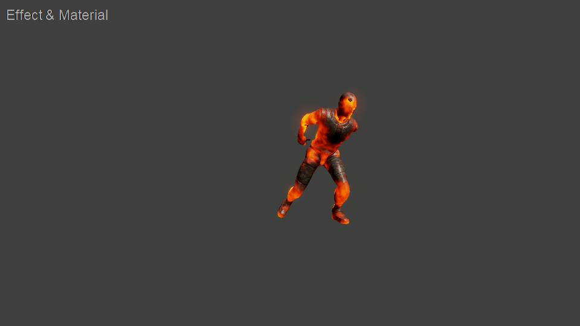
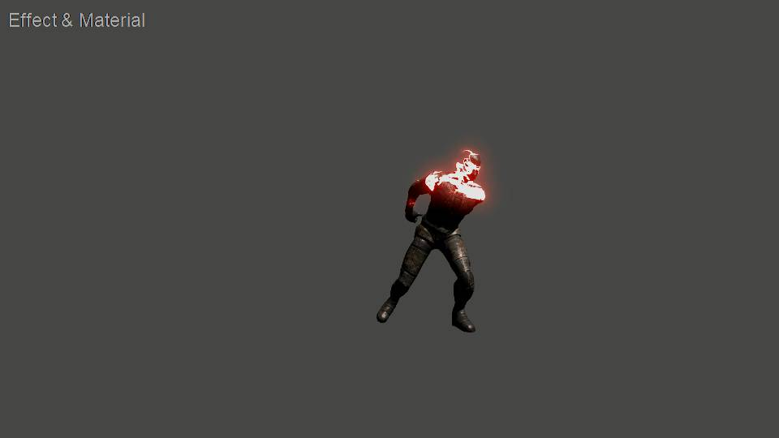

# Shader

## BRDF : 비교

## Lighting Model : Basic Lighting Model

## Rim Lighting : Hologram

## FlowMap

## Stencil

## Skin Material : Unreal Engine

## Landscape : Unreal Engine

## Effect & Material

# End
